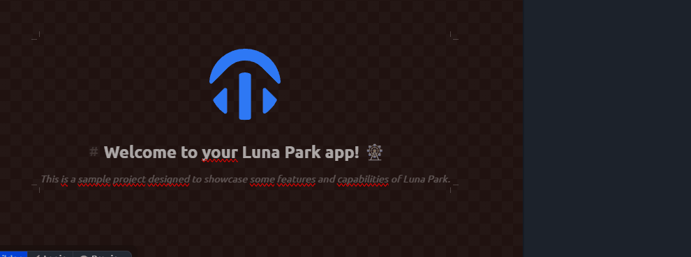
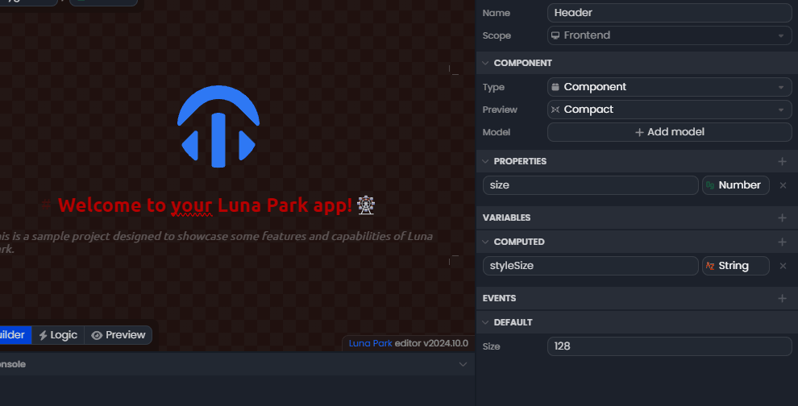

## Element Styling

Each element in your project can be styled individually using the inspector panel under the **style** tab. This allows you to customize the appearance of every component in your application, such as text, images, or buttons.

To add a style category (e.g., color, typography, size), simply click the **+** button in the style tab. A list of properties will appear, and you can enable or disable each property by clicking on its name.  
For example, you can add or remove borders or shadows.

_Note: All style rules available in Luna Park correspond to standard CSS rules found in web development._

## Global Colors and Design Tokens

Luna Park also allows you to use **global design tokens**, which are predefined colors, fonts, or sizes for the entire site. These ensure visual consistency. If you update a **global token**, all elements using that token will automatically reflect the change.

To use a global token:

1. Hover over the value you want to change (e.g., a color).
2. When the blue circle appears in the top-right corner of the value, click it.
3. Select the place icon to choose a global token.

This is especially useful for creating a uniform style across your site, such as consistent text colors or a unified font.

 

## Style Variables

In Luna Park, some variables can be used to manage the dynamic styling of elements in your application. This means that if the value of a variable changes, all elements relying on that variable will update automatically.  
There are three main types of variables in Luna Park:

- **Properties**: These are configurable parameters for each component. They define attributes like size, color, or other visual and behavioral properties. Properties are often modifiable directly in the interface and can be passed from a parent component to a child component.  
  _Example_: A <Highlight text="size"/> property can define the size of a button. If <Highlight text="size"/> is updated, the button will resize automatically.

- **Variables**: These are internal values specific to each component, storing temporary data or local states. They are particularly useful for managing intermediate values in your app's logic.  
  _Example_: A variable <Highlight text="isVisible"/> could control the visibility of an element. Changing <Highlight text="isVisible"/> from <Highlight text="true"/> to <Highlight text="false"/> would automatically show or hide the element.

_Note: There are also <Highlight text="Computed"/> variables, which are automatically updated based on other properties or variables. These are mainly used in advanced logic cases and will be covered in the visual scripting section._

## Using Variables

To use a variable in a component's property:

1. Hover over the value you want to bind to a variable.
2. A blue circle will appear in the top-right corner of the value. Click it to display available options.
3. Select the place icon to choose an existing variable.

_Note: Only variables matching the expected type for that property will be available in the list. For example, a numeric variable will only appear for a property expecting a number._

By using these style variables, you can create responsive applications where components adjust dynamically based on state changes.
