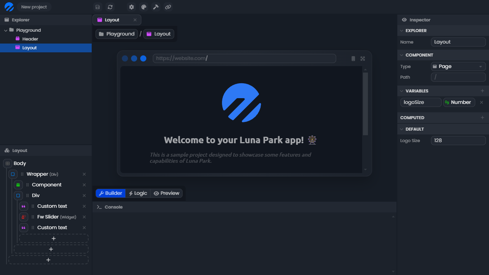

# Components

**Component** files are used to define the interface of your application. They allow you to create reusable visual elements throughout your project.

## Pages

To define a component as a **page**, simply change its type in the inspector. You can then define a path to access the page. The main page of your application will always be `/` (with nothing following).

