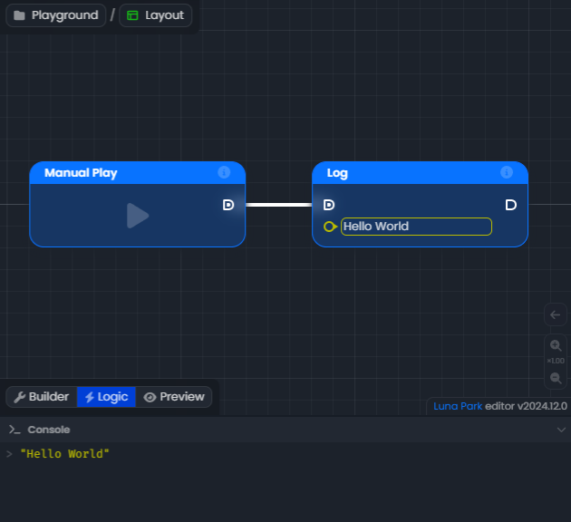
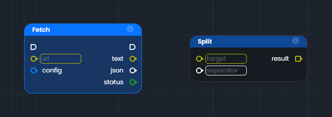
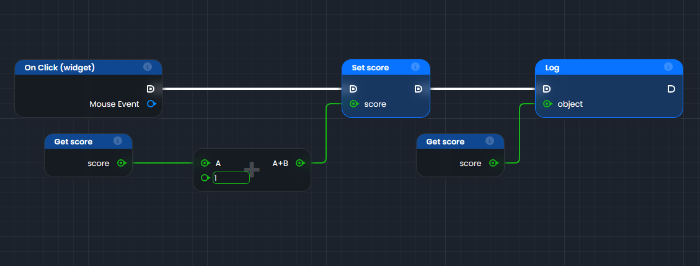
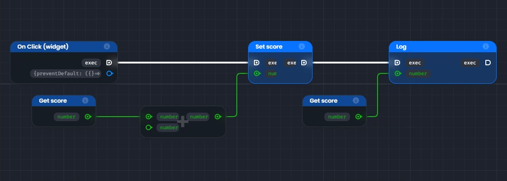
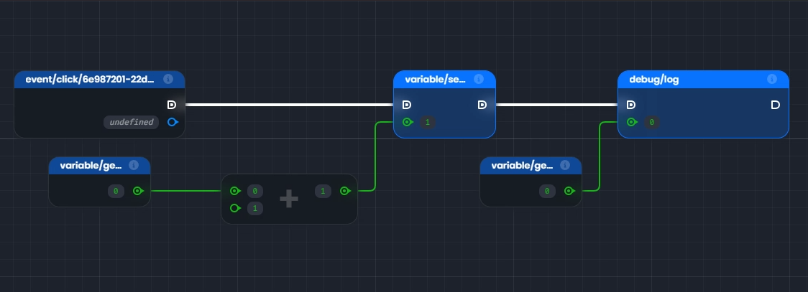

# The Graph

The graph is the foundation of visual logic in Luna Park. This is where you will build the logic of your application. It consists of nodes, links, and anchors that interact to create logical flows.

- **Nodes**: A node represents an action, a condition, or an operation.
- **Anchors**: Each node has input and output anchors. Input anchors are used to receive data, while output anchors send data.
- **Links**: Links connect the anchors to each other, forming a logical flow.

Here is an example of a simple graph in Luna Park:

## Nodes

Nodes are the basic logical building blocks that can be placed on the graph. There are two main types of nodes:

- **Function Nodes**: These nodes have a blue background. They have input and/or output execution anchors. They execute when their input execution anchor is triggered.
- **Operation Nodes**: These nodes have a dark gray background. They do not have input and/or output execution anchors. They execute when their result anchor is called by a function node.

## Anchors

Anchors are the interfaces of the nodes. Input anchors are displayed on the left, and output anchors on the right. There are two types of anchors:

- **Execution Anchors** (<DAnchorIcon :schema="LogicType.exec()" />)
  These anchors are displayed with a rounded square shape on the right. They are intended to be connected to the execution flow. A function node will be executed when the execution flow leading to its execution anchors is triggered. Then, after its execution, the node will trigger its output execution anchor.

- **Value Anchors** (<DAnchorIcon :schema="LogicType.unknown()" /> / <DAnchorIcon :schema="LogicType.array(LogicType.unknown())" />)
  These anchors are displayed with a circular shape when they contain a single value, or a square shape when they contain a list (called an array) of values. When using input anchors, you can specify certain types, such as text or a number, in the input next to the anchor. The color of the anchor depends on the type of value it contains.

| Type                                                                                       | Example                                             | Type | Example                                                                              |
|--------------------------------------------------------------------------------------------|-----------------------------------------------------|------|--------------------------------------------------------------------------------------|
| <DAnchorIcon :schema="LogicType.boolean()"/> <DSchemaType :schema="LogicType.boolean()" /> | <DSchemaValue :value="true" />                      | <DAnchorIcon :schema="LogicType.array(LogicType.boolean())" /> <DSchemaType :schema="LogicType.array(LogicType.boolean())" /> | <DSchemaValue :value="[true, false, false]" />                                       |
| <DAnchorIcon :schema="LogicType.number()"/> <DSchemaType :schema="LogicType.number()" /> | <DSchemaValue :value="1980" />                      | <DAnchorIcon :schema="LogicType.array(LogicType.number())" /> <DSchemaType :schema="LogicType.array(LogicType.number())" /> | <DSchemaValue :value="[1980, 2020]" />                                               |
| <DAnchorIcon :schema="LogicType.string()"/> <DSchemaType :schema="LogicType.string()" /> | <DSchemaValue :value="'Hello World'" />             | <DAnchorIcon :schema="LogicType.array(LogicType.string())" /> <DSchemaType :schema="LogicType.array(LogicType.string())" /> | <DSchemaValue :value="['Hello', 'World']" />                                         |
| <DAnchorIcon :schema="LogicType.object({name: LogicType.string(), age: LogicType.number()})" /> <DSchemaType :schema="LogicType.object({name: LogicType.string(), age: LogicType.number()})" /> | <DSchemaValue :value="{ name: 'John', age: 30 }" /> | <DAnchorIcon :schema="LogicType.array(LogicType.object({name: LogicType.string(), age: LogicType.number()}))" /> <DSchemaType :schema="LogicType.array(LogicType.object({name: LogicType.string(), age: LogicType.number()}))" /> | <DSchemaValue :value="[{'name': 'John', 'age': 30}, {'name': 'Jane', 'age': 25}]" /> |
| <DAnchorIcon :schema="LogicType.unknown()" /> <DSchemaType :schema="LogicType.unknown()" /> | <DSchemaValue value="Hello world" />                | <DAnchorIcon :schema="LogicType.array(LogicType.unknown())" /> <DSchemaType :schema="LogicType.array(LogicType.unknown())" /> | <DSchemaValue :value="['Hello', 1234]" />                                            |

## Links

Links are the lines that connect the anchors to each other in a logical graph. Their appearance changes according to their role:
- **Execution Flow**: They are white and thick to represent a logical execution flow.
- **Value Flow**: They take the color of the type of value they carry (e.g., green for a number, yellow for text).

## Connecting Anchors

Links allow you to connect anchors of compatible types:
Generally, you will connect input and output anchors of the same type.

However, you can also connect an output anchor to a less defined input anchor. For example, it is possible to connect an output anchor of an array of numbers to an input anchor of an array of unknown type.

## Example of Logic in the Graph

In this example, we have a simple logic built with nodes and links in the graph.

### Step-by-Step

1. **Trigger: "On Click (widget)"**
   - This node represents an event that starts execution when a user clicks on an element in your interface (e.g., a button).
   - The white link (execution flow) starts from this node and triggers the following actions.
2. **Reading Set score**
   - This function node updates a value called `score`.
   - It is executed by the execution flow from "On Click".
   - The green score connection (data flow) sends a new value of `score` from another node, so we trace back the chain to retrieve the value.
3. **Addition (+)**
   - This operation node adds two values:
      - `A` (linked to another node).
      - `1` (a fixed value added directly).
   - The green connection of `A` (data flow) requires tracing back a bit further in the chain to retrieve its value.
4. **Get score**
   - This operation node retrieves the current value of `score`.
   - It can then be used to add to `1` in the addition operation node.
5. **Execution of Set score**
   - Once the operation nodes are executed to retrieve the new value of score, the value of `score` is updated with the result of the addition.
   - The white link (execution flow) starts from this node and triggers the following actions.
6. **Reading Log**
   - This function node displays or records a value for debugging.
   - It is executed after "Set score" via the white flow.
   - The green connection sends the current value of score to display it.
7. **Get score**
   - This operation node retrieves the new value of `score`.
   - It can then be used to display it in the Log node.
8. **Execution of Log**
   - Once the operation node is executed to retrieve the new value of score, the new value can be logged.
   - There is no white link (execution flow) starting from this node, as there are no further actions to execute after this.

### Visual Summary of the Flow:

1. "On Click" → "Set score" → "Log".
   - The white links represent the order in which the actions are executed.
2. The colored links carry the data:
   - `score` is retrieved with "Get score".
   - It is modified (+1) and then updated with "Set score".
   - Finally, it is sent to the "Log" to be displayed.

## Inspecting the Graph

Inspection allows you to check the **values** and **types** held by the anchors through two modes:

**Type Inspection**: To visualize data types. `Ctrl + Alt`

**Value Inspection**: To display the actual values of the anchors. `Ctrl + Space` or `Ctrl + Q`

When using value inspection, the values are:
- Calculated in real-time for operation nodes.
- Taken from the last execution for function nodes.

<LContainer type="info">
<h2>Note</h2>
If some values appear as undefined, it may be necessary to run your logic once to initialize all the values.
</LContainer>

