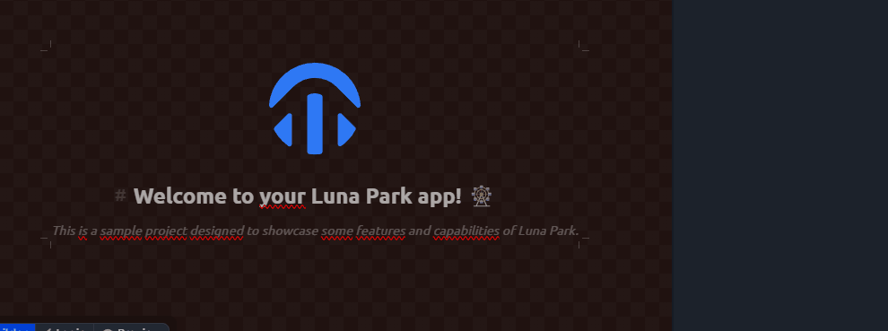

## Stylisation des éléments

Chaque élément de votre projet peut être stylisé individuellement dans le panneau d'inspection, sous l'onglet **style**. Cela vous permet de personnaliser l'apparence de chaque composant de votre application, comme les textes, les images, ou les boutons.

Pour ajouter une catégorie de style (par exemple, couleur, typographie, taille), cliquez simplement sur le bouton **+** dans l'onglet style. Une liste de propriétés s'affichera. Vous pouvez activer ou désactiver chaque propriété en cliquant sur son nom.  
Par exemple, pour ajouter ou retirer une bordure ou une ombre.

_Note : Toutes les règles de style disponibles dans Luna Park correspondent aux règles CSS que l’on peut retrouver dans les standards web._
## Couleurs et tokens de design globaux

Luna Park permet aussi d’utiliser des tokens de **design globaux**, qui sont des couleurs, polices ou tailles définies pour tout le site, afin de garder une cohérence visuelle. Si vous changez un **token global**, tous les éléments qui utilisent ce token seront automatiquement mis à jour pour refléter ce changement.

Pour utiliser un token global :

1. Passez votre souris sur la valeur que vous voulez changer (par exemple, la couleur).
2. Lorsque le cercle bleu apparaît en haut à droite de la valeur, cliquez dessus.
3. Sélectionnez l’icône place pour choisir un token global.

Cela est particulièrement utile si vous voulez créer un style uniforme pour tout le site, comme une couleur de texte cohérente ou une police unique.

 

## Variables de style

Dans Luna Park, certaines variables peuvent être utilisées pour gérer la stylisation dynamique des éléments de votre application. Cela signifie que si la valeur d'une variable change, tous les éléments qui dépendent de cette variable se mettront automatiquement à jour.
Il existe trois types principaux de variables dans Luna Park :

- **Properties** : Ces variables sont des paramètres de base configurables pour chaque composant. Elles permettent de définir des attributs comme la taille, la couleur ou d'autres propriétés visuelles et comportementales. Les properties sont souvent modifiables directement dans l'interface et peuvent être passées d'un composant parent à un composant enfant.
   
   
  _Exemple_ : Une property <Highlight text="size" /> peut être utilisée pour définir la taille d'un bouton. Si <Highlight text="size"/> est mis à jour, le bouton sera automatiquement redimensionné.Une property size peut être utilisée pour définir la taille d'un bouton. Si size est mis à jour, le bouton sera automatiquement redimensionné.
   
   
- **Variables** : Ce sont des valeurs internes spécifiques à chaque composant, qui stockent des informations temporaires ou des états locaux. Elles sont particulièrement utiles pour gérer des valeurs intermédiaires dans la logique de votre application.
   
   
  _Exemple_ : Une variable <Highlight text="isVisible"/> pourrait contrôler l'affichage d'un élément. En changeant isVisible de <Highlight text="true"/> à <Highlight text="false"/>, l'élément pourrait apparaître ou disparaître automatiquement.

_Note : Il existe également des variables dites <Highlight text="Computed"/> (calculées), qui sont automatiquement mises à jour en fonction d'autres properties ou variables. Celles-ci sont surtout utilisées dans des cas de logique avancée, et seront abordées plus en détail dans la section sur la programmation visuelle._
## Utilisation des variables
Pour utiliser une variable dans une propriété de votre composant :

Survolez la valeur que vous souhaitez lier à une variable.
Un cercle bleu apparaîtra en haut à droite de la valeur. Cliquez dessus pour afficher les options disponibles.
Sélectionnez l'icône place pour choisir une variable existante.

_Note : Seules les variables correspondant au type attendu pour cette propriété seront disponibles dans la liste. Par exemple, une variable numérique apparaîtra uniquement pour une propriété attendue comme un nombre._

En utilisant ces variables de style, vous pouvez créer des applications réactives où les composants s’ajustent automatiquement en fonction des changements d’état.
