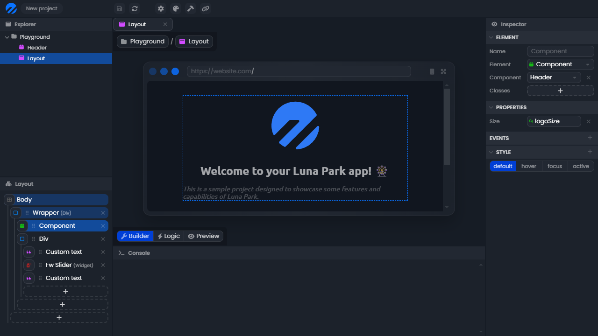
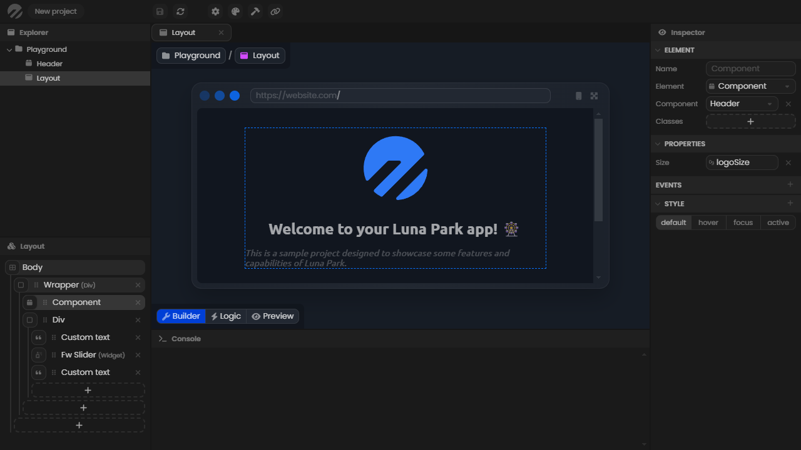

# Éditeur de Luna Park

Le **Builder** Luna Park vous permet de construire votre application en utilisant des mises en page et une logique visuelle. Il est composé de plusieurs panneaux qui servent à différentes fins.

## Panneau de l'explorateur

Le panneau de l'explorateur est situé en haut à gauche de l'éditeur. Il vous permet de créer un nouveau fichier avec un <Highlight text="clic droit"/>, de le sélectionner avec un <Highlight text="double clic"/>, et de le supprimer avec la touche <Highlight text="suppr"/>. Vous pouvez créer des dossiers pour mieux organiser votre projet, mais la structure n'affecte pas la logique de votre application.

## Panneau d'options

Le panneau d'options se trouve en bas à gauche de l'éditeur. Il affiche diverses informations relatives au fichier en cours d'utilisation. Dans ce cas, un composant de mise en page est le fichier en cours, et le panneau d'options affiche son arbre de mise en page. Pour définir un fichier comme fichier de travail, vous devez <Highlight text="double cliquer"/> dessus dans le panneau de l'explorateur.

## Panneau d'inspection

Le panneau d'inspection est situé sur le côté droit de l'éditeur. Il affiche diverses informations relatives à l'élément sélectionné (un fichier, un élément de mise en page, un nœud logique, etc.). Dans ce cas, un élément de mise en page est sélectionné, et l'inspecteur affiche tout ce qui le définit.

## Panneau de la console

Le panneau de la console est situé en bas de l'éditeur. Il vous permet de journaliser des valeurs pour déboguer votre application. Pour afficher une valeur dedans, vous devez utiliser le nœud <Highlight text="Log"/> dans l'éditeur de logique. Gardez à l'esprit que la valeur sera également enregistrée dans la console de votre navigateur.

## Vue

Enfin, la vue est la partie principale de l'éditeur. Elle affiche une visualisation du fichier de travail. Dans ce cas, le mode constructeur d'un composant de mise en page est sélectionné, donc elle affiche le constructeur visuel de la mise en page.

# Mises en page de page

Les mises en page (Layout) sont un type spécial de composants. Elles sont utilisées pour définir la structure d'une page et seront accessibles depuis votre application.

## Configuration du composant

Pour définir un composant comme composant de mise en page, il suffit de définir le **type** sur **page** dans le panneau d'inspection. Vous pourrez alors définir un **chemin** pour accéder à la page. La page principale de votre application doit être définie sur **/**.

