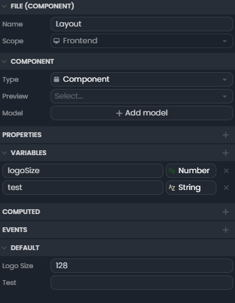

# Composants

Les fichiers **composants** sont utilisées pour définir l'interface de votre application. Ils permettent de créer des éléments visuels réutilisables partout dans votre projet.

## Pages

Pour définir un composant comme **page**, il suffit de changer son type dans l'inspecteur. Vous pourrez alors définir un chemin pour accéder à la page. La page principale de votre application sera toujours `/` (sans rien derrière).

