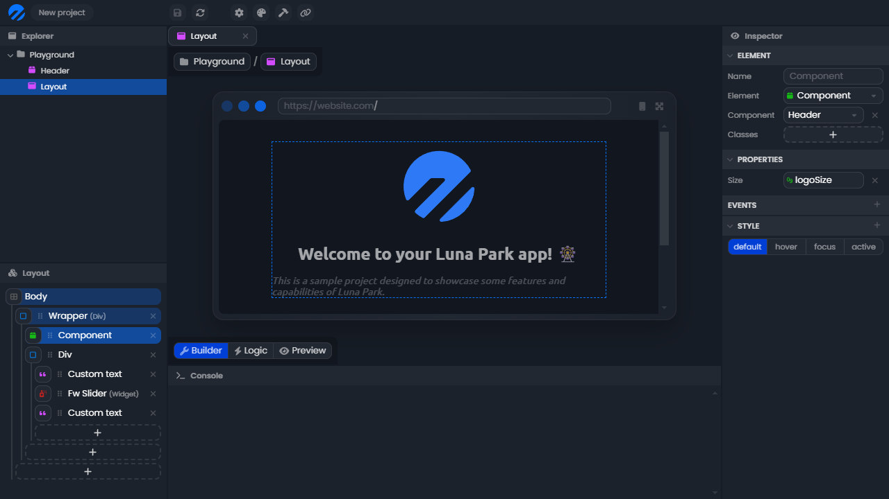
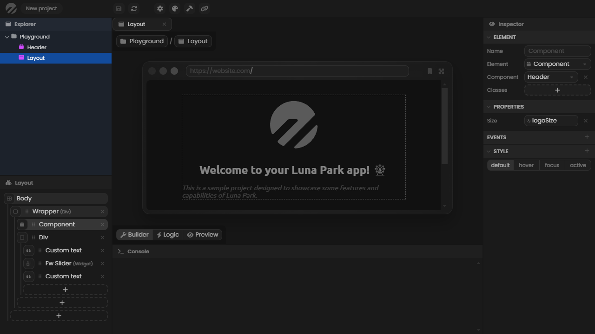
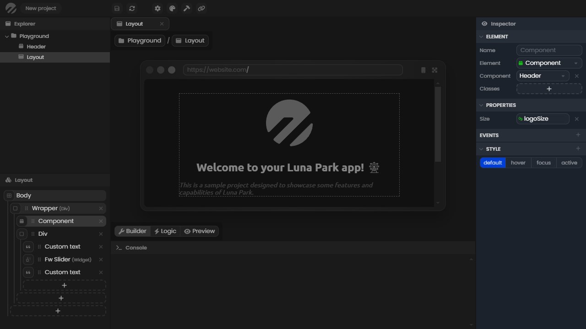

# Éditeur

L'éditeur vous permet de construire votre application en utilisant des mises en page et une logique visuelle. Il est composé de plusieurs panneaux qui servent à différentes fins.

## L'explorateur

L'explorateur est situé en haut à gauche de l'éditeur. Il vous permet de créer un nouveau fichier avec un `clic droit`, de le sélectionner avec un `double clic`, et de le supprimer avec la touche `suppr`. Vous pouvez créer des dossiers pour mieux organiser votre projet, mais la structure n'affecte pas la logique de votre application.

## Panneau d'options

Le panneau d'options se trouve en bas à gauche de l'éditeur. Il affiche diverses informations relatives au fichier en cours d'utilisation. Ici, un composant de mise en page est ouvert, et le panneau d'options affiche son arbre de mise en page. Pour définir un fichier comme fichier de travail, vous devez `double cliquer` dessus dans le panneau de l'explorateur.

## L'inspecteur

L'inspecteur est situé sur le côté droit de l'éditeur. Il affiche diverses informations relatives à l'élément sélectionné (un fichier, un élément de mise en page, un nœud logique, etc.). Ici, un élément de mise en page est sélectionné, et l'inspecteur affiche ses propriétés.

## La console

La console est situé en bas de l'éditeur. Il vous permet de logger des valeurs pour déboguer votre application. Pour afficher une valeur dedans, vous devez utiliser le nœud `log` dans l'éditeur de logique. Notez que la valeur sera également envoyée dans la console de votre navigateur.

## La vue principale

Enfin, la vue principale est la partie centrale de l'éditeur. Elle affiche une visualisation du fichier de travail. Dans ce cas, le mode constructeur d'un composant de mise en page est sélectionné, donc elle affiche le constructeur visuel de la mise en page.

