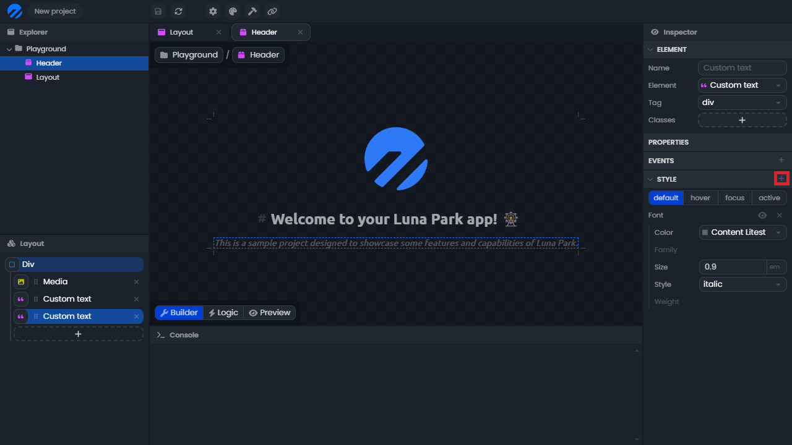

# Stylisation

## Stylisation des éléments

Chaque élément de votre projet peut être stylisé individuellement dans l'inspecteur, sous l'onglet **style**. Cela vous permet de personnaliser l'apparence de chaque composant de votre application, comme les textes, les images, ou les boutons.

Pour ajouter une catégorie de style (par exemple, couleur, typographie, taille), cliquez simplement sur le bouton **+** dans l'onglet style. Vous pouvez activer ou désactiver chaque propriété en cliquant sur son nom.

_Note : Toutes les règles de style disponibles dans Luna Park correspondent aux règles CSS que l’on peut retrouver dans les standards web._

## Design tokens

Luna Park permet aussi d’utiliser des design tokens. Ce sont des valeurs réutilisables qui permettent d'avoir un style cohérent dans toute l'application. Par exemple, vous pouvez définir une couleur primaire et l'utiliser partout dans votre application. Cela facilite la gestion des styles et permet de faire des changements globaux rapidement.

_Note : pour l'instant, les design tokens sont fixés. Ils n'est pas encore possible de les modifier ou d'en ajouté dans l'éditeur._

Pour utiliser un design token :

1. Survolez la valeur que vous voulez changer.
2. Cliquer sur l'icône de lien pour passer en mode de sélection de design token.
3. Sélectionnez le design token que vous souhaitez utiliser.

## Variables de style

Il est également possible d'utiliser des variables pour styliser vos composants. Ces variables peuvent être utilisées dans les propriétés de style de vos composants. Cela vous permet de créer des styles dynamiques qui changent en fonction de l'état de votre application.

Pour utiliser une variable dans une propriété de votre composant :

1. Survolez la valeur que vous souhaitez lier à une variable.
2. Cliquez sur l'icône d'éclair pour passer en mode de sélection de variable.
3. Sélectionnez la variable que vous souhaitez utiliser.

_Note : Seules les variables correspondant au type attendu pour cette propriété seront disponibles dans la liste. Par exemple, une variable numérique apparaîtra uniquement pour une propriété attendue comme un nombre._
