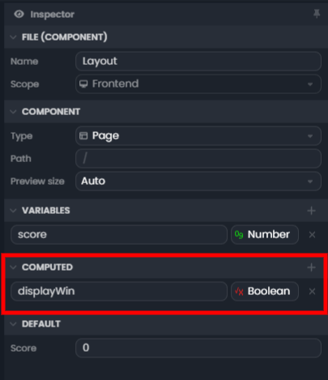
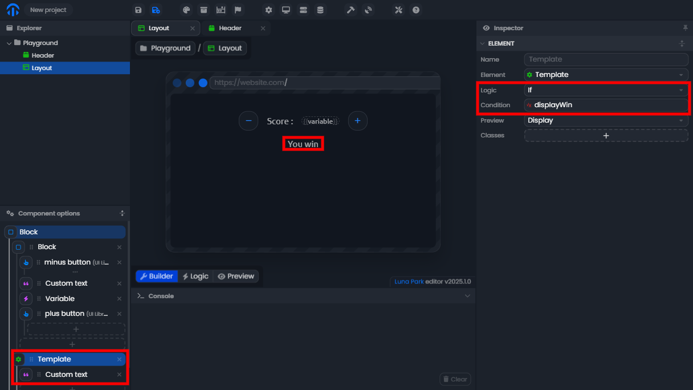
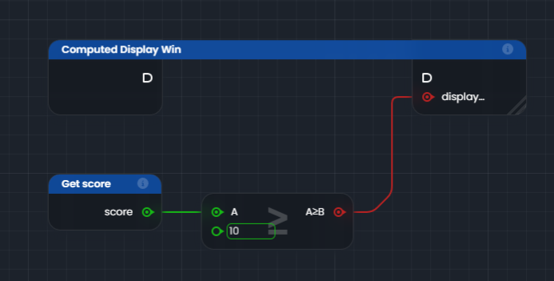
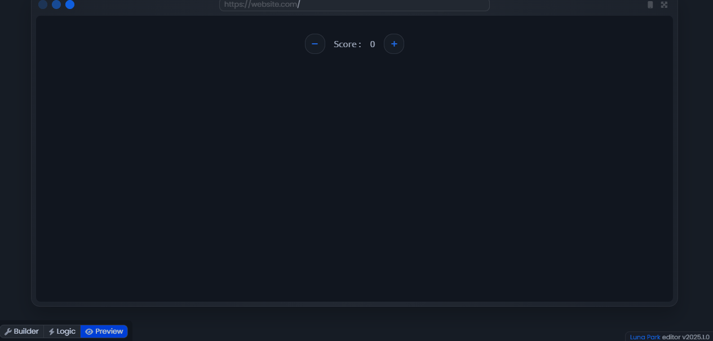
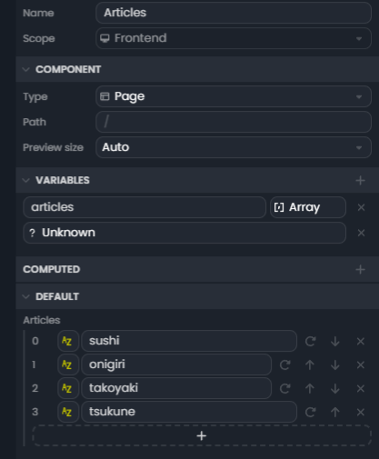
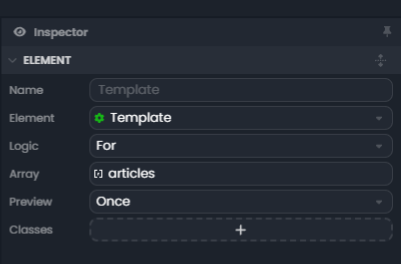
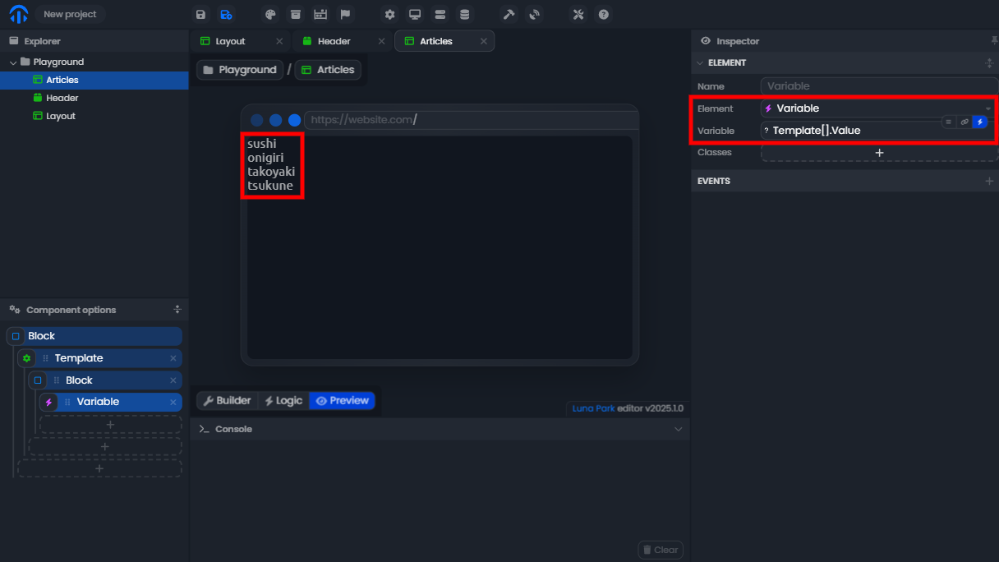

# Les éléments de template

## Le templates If

Les éléments de template If permettent d’afficher ou de masquer des éléments de l’interface en fonction d’une condition.

Exemple : Afficher un message conditionnel avec une variable computed

Dans cet exemple, nous allons afficher un message "You win" lorsque le score dépasse une certaine valeur. Pour cela, nous allons :

1. **Créer une variable computed** pour vérifier si le score est supérieur à `10`.
2. **Utiliser cette variable computed** pour afficher ou masquer un message dans l’interface.

### 1. Définir la variable computed

1. Sélectionnez le composant **Layout**.
2. Dans le panneau **Inspector**, ajoutez une variable computed appelée `displayWin`.
3. Définissez-la comme un **booléen** (vrai ou faux).

### 2. Utiliser la variable computed dans l’interface

1. Ajoutez un élément **Template** dans l’interface.
2. À l’intérieur du Template, insérez un composant de texte avec le message "You win".
3. Dans le panneau d'inspection, associez le composant **Template** à la condition `displayWin`.
- Si `displayWin` est vrai, le message sera affiché.
- Si `displayWin` est faux, le message ne sera pas affiché.

### 3. Définir la logique pour la variable computed

1. Dans le graphe, ajoutez un nœud Get score pour récupérer la valeur actuelle de la variable `score`.
2. Utilisez un nœud Condition (`A >= B`) pour vérifier si le score est supérieur ou égal à `10`.
3. Reliez le résultat de cette condition à la variable **computed displayWin**.

### 4. Tester votre logique

- Modifiez le score en utilisant les boutons dans l’interface.
- Lorsque le score atteint ou dépasse `10`, le message "You win" devrait apparaître automatiquement.

## Le template For

Le template For permet de répéter un élément plusieurs fois en fonction d’un tableau ou d’une liste. Il est utile pour afficher dynamiquement des éléments similaires dans l’interface.

Exemple : Afficher une liste d’articles

### 1. Création de la page et de la variable articles
1. Créez une nouvelle page nommée **Articles**.
2. Dans le panneau **Inspector**, ajoutez une variable de type **Array** (tableau) appelée `articles`.
3. Remplissez cette variable avec des valeurs, par exemple :   <DSchemaValue :value='["sushi", "onigiri", "takoyaki", "tsukune"]'/>.

### 2. Mise en place de la logique de boucle
1. Ajoutez un composant **Template** dans l’interface.
2. Configurez le Template avec la logique **For** et associez-le à la variable `articles`.
3. La logique For permet de parcourir chaque élément du tableau `articles`.
4. Le Template exécutera son contenu une fois pour chaque article.

### 3. Affichage des éléments dans l’interface
1. À l’intérieur du Template, ajoutez un **Div**.
2. Insérez un composant **Variable** dans ce div.
3. Associez cette variable à `Template[].Value`, qui correspond à chaque élément du tableau parcouru.
4. Désormais, lorsque vous visualisez la page **Articles** dans l’interface, vous verrez chaque élément du tableau `articles` affiché dans un nouveau bloc.

