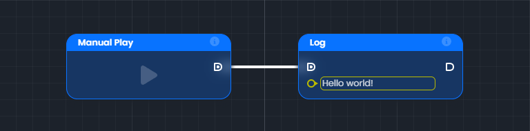

# Le visual scripting

Le visual scripting vous permet de définir la logique et le flux de contrôle de vos projets sans écrire de code. Vous pouvez créer des scripts en reliant des blocs (appelés nœuds) les uns aux autres dans une structure en graphe. Ces nœuds offrent une variété d'actions, comme comparer des valeurs, appeler une API, ou trier une liste
## Le graphe

Le graphe est la grille où vous pouvez placer des nœuds. La grille est infinie dans les deux directions, mais vous devriez garder votre graphe logique assez petit.   
Si votre graphe devient trop complexe, il peut être utile de factoriser certaines logiques en créant de nouvelles fonctions, qui pourront ensuite être utilisées comme nœuds.   
Sur l'éditeur, vous pouvez déplacer la grille et zoomer pour avoir une meilleure vue de ce sur quoi vous travaillez.

## Nœuds

Les nœuds sont des briques logiques de base que l'on peut placer sur la grille. Il existe deux types principaux de nœuds :

- **Nœuds de fonction** : Ces nœuds ont un fond bleu. Ils ont des ancres d'exécution d'entrée et/ou de sortie. Ils sont destinés à être exécutés par le fil d'exécution.
- **Nœuds d'opération** : Ces nœuds ont un fond gris foncé. Ils n'ont pas d'ancres d'exécution d'entrée et/ou de sortie. Ils sont destinés à être évalués au besoin par les nœuds de fonction exécutés.

** placer nœuds **
** placer instructions **

## Ancres

Les ancres sont l'interface du nœud. Les ancres d'entrée sont affichées à gauche du nœud, les ancres de sortie à droite. Il existe deux types d'ancres :

- **Ancres d'exécution** (**placer icône**)
  Ces ancres sont affichées avec une forme carrée arrondie à gauche. Elles sont destinées à être reliées au fil d'exécution. Un nœud de fonction sera exécuté lorsque le fil d'exécution menant à ses ancres d'exécution sera déclenché. Ensuite, après son exécution, le nœud déclenchera son ancre d'exécution de sortie.

- **Ancres de valeur** (**placer icône**/**placer icône**)
  Ces ancres sont affichées avec une forme circulaire lorsqu'elles contiennent une seule valeur, ou une forme carrée lorsqu'elles contiennent une liste (appelée tableau) de valeurs. Lorsque vous utilisez des ancres d'entrée, vous pouvez spécifier certains types, comme chaîne ou nombre, dans l'entrée à côté de l'ancre. La couleur de l'ancre dépend du type de valeur qu'elle contient.

<TypeTable
:columns="[
{ title: 'Type', key: 'type' },
{ title: 'Exemple', key: 'example' },
{ title: 'Type', key: 'type2' },
{ title: 'Exemple', key: 'example2' }
]"
:rows="visualScriptingEditorTableData"
/>
