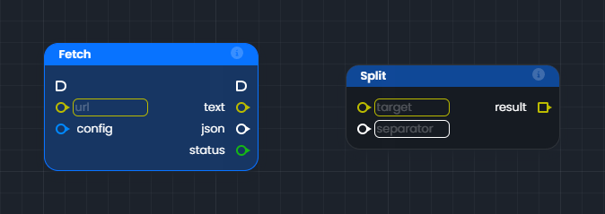
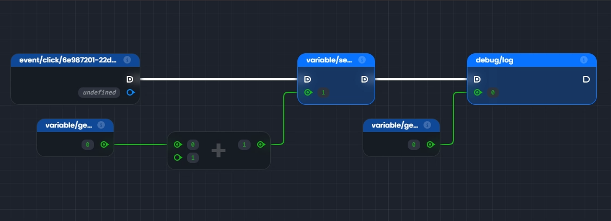

# Le graphe
Le graphe de Luna Park est l’outil central pour ajouter de la logique visuelle à votre application. Contrairement à l’éditeur visuel, qui sert à construire l’interface utilisateur, le graphe vous permet de définir les interactions et les workflows de manière intuitive.

Un graphe est composé de nœuds connectés par des liens représentant des flux de logique ou de données. Voici les éléments principaux d'un graphe :

- **Nœuds** : Chaque nœud représente une action, une condition, ou une opération.
- **Connexions** : Les liens entre les nœuds représentent le chemin logique ou les données échangées.
- **Entrées/Sorties** : Chaque nœud possède des points d'entrée et de sortie pour connecter les données ou la logique.

Voici un exemple de graphe simple dans Luna Park :

## Nœuds

Les nœuds sont des briques logiques de base que l'on peut placer sur la grille. Il existe deux types principaux de nœuds :

- **Nœuds de fonction** : Ces nœuds ont un fond **bleu**. Ils ont des ancres d'exécution d'entrée et/ou de sortie. Ils **s’exécutent** lorsqu’ils sont **connectés** dans le flux logique par le **fil d'exécution**.
- **Nœuds d'opération** : Ces nœuds ont un fond **gris foncé**. Ils n'ont pas d'ancres d'exécution d'entrée et/ou de sortie. Ils servent à **manipuler** ou **transformer** des données et sont utilisés par les nœuds de fonction.

## Ancres

Les ancres sont l'interface du nœud. Les ancres d'entrée sont affichées à gauche du nœud, les ancres de sortie à droite. Il existe deux types d'ancres :

- **Ancres d'exécution** (<Anchor color="white" type="execution"/>)
  Ces ancres sont affichées avec une forme carrée arrondie à gauche. Elles sont destinées à être reliées au fil d'exécution. Un nœud de fonction sera exécuté lorsque le fil d'exécution menant à ses ancres d'exécution sera déclenché. Ensuite, après son exécution, le nœud déclenchera son ancre d'exécution de sortie.

- **Ancres de valeur** (<Anchor color="white" type="value"/> / <Anchor color="white" type="array"/>)
  Ces ancres sont affichées avec une forme circulaire lorsqu'elles contiennent une seule valeur, ou une forme carrée lorsqu'elles contiennent une liste (appelée tableau) de valeurs. Lorsque vous utilisez des ancres d'entrée, vous pouvez spécifier certains types, comme chaîne ou nombre, dans l'entrée à côté de l'ancre. La couleur de l'ancre dépend du type de valeur qu'elle contient.

<TypeTable
:columns="[
{ title: 'Type', key: 'type' },
{ title: 'Exemple', key: 'example' },
{ title: 'Type', key: 'type2' },
{ title: 'Exemple', key: 'example2' }
]"
:rows="visualScriptingEditorTableData"
/>

## Fils

Les fils (communément appelés **wires**) sont les lignes qui connectent les ancres entre elles dans un graphe logique. Leur apparence change selon leur rôle :
- **Fil d'exécution** : ils sont blancs et épais pour représenter un flux d'exécution logique.
- **Fil de valeur** : ils prennent la couleur du type de valeur qu'ils transportent (ex. : vert pour un nombre, jaune pour une chaîne).

## Connexion des ancres

Les **wires** permettent de connecter des ancres de types compatibles :
En général, vous connecterez des ancres d’**entrée** et de **sortie** ayant le **même type**.   
Vous pouvez relier des ancres moins définies. Par exemple, il est possible de connecter un **tableau de chaînes** (sortie) à une **entrée** d’un tableau de type inconnu, mais pas l’inverse.

## Exemple de logique dans le graphe

Dans cet exemple, nous avons une logique simple construite avec des nœuds et des wires dans le graphe.

_Ne vous inquiétez pas si certains concepts comme les variables ou les fonctions ne vous semblent pas encore clairs. Nous les aborderons plus en détail dans les prochains chapitres._

### Étape par étape

1. Déclencheur : "On Click (widget)"
   - Ce nœud représente un **événement** qui démarre la logique lorsqu’un utilisateur clique sur un élément (un bouton ou un widget).
   - Le fil blanc (**fil d’exécution**) part de ce nœud et déclenche les actions suivantes.
2. "Set score" (nœud de fonction)
   - Ce nœud **met à jour une valeur** appelée <Highlight text="score" />.
   - Il est **exécuté** par le fil d’exécution venant de "On Click".
   - La connexion verte (fil de données) envoie une nouvelle valeur de <Highlight text="score" /> depuis un autre nœud.
3. "Get score" (nœud d’opération)
    - Ici, le nœud **récupère la valeur actuelle** de <Highlight text="score" />.
    - Il n’a pas d’exécution (pas de fil blanc), car il s’agit uniquement d’une opération pour obtenir des données.
4. Addition(+)
    - Le nœud d’opération au centre additionne deux valeurs :
      - <Highlight text="A"/> (récupérée depuis le premier "Get score")
      - <Highlight text="1" /> (une valeur fixe ajoutée directement).
    - Le résultat est renvoyé vers le "Set score", qui met à jour la nouvelle valeur de score.
5. Log (nœud de fonction) 
    - Ce nœud affiche ou enregistre une valeur pour le débogage.
    - Il est exécuté après "Set score" via le fil blanc.
    - La connexion verte envoie la valeur actuelle de score pour l’afficher.

### Résumé visuel du flux :

1. "On Click" → "Set score" → "Log".
    - Le fil blanc représente l’ordre dans lequel les actions sont exécutées.
2. Les **wires verts** transportent les données : 
    - <Highlight text="score" /> est récupéré avec "Get score".
    - Il est modifié (+1) puis mis à jour avec "Set score".
    - Enfin, il est envoyé au "Log" pour être affiché.

## Inspection du graphe

L’inspection vous permet de vérifier les **valeurs** et **types** détenus par les ancres grâce à deux modes :   
**Type inspection** : pour visualiser les types de données. <Highlight text="Ctrl + Alt" />
  

 
**Value inspection** : pour afficher les valeurs réelles des ancres. <Highlight text="Ctrl + Space" />
    

Lorsque vous utilisez l’inspection des valeurs, celles-ci sont :
- Calculées en temps réel pour les **nœuds d’opération**.
- Issues de la **dernière exécution** pour les **nœuds de fonction**.

<LContainer type="info">
<h2>Note</h2>
Si certaines valeurs apparaissent comme indéfinies, il peut être nécessaire d’exécuter votre logique une fois pour initialiser toutes les valeurs.
</LContainer>
