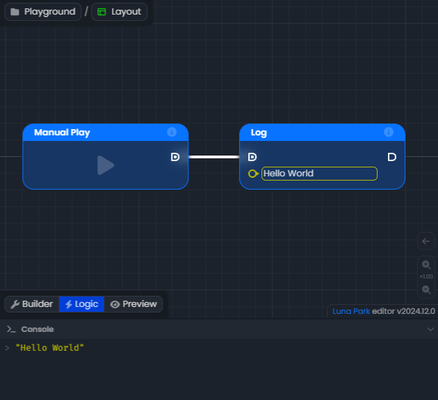
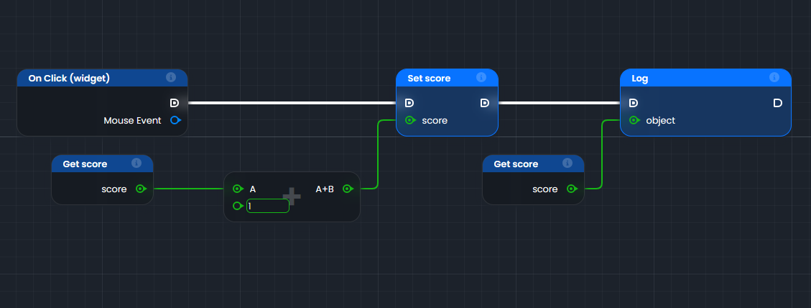
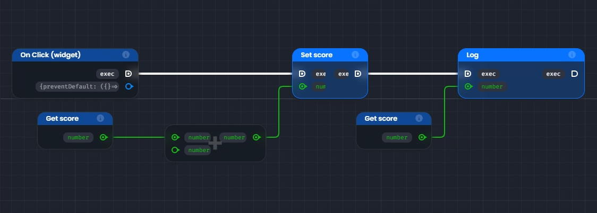

# Le graphe

Le graphe est la base de la logique visuelle dans Luna Park. C'est sur celui-ci que vous allez construire la logique de votre application. Il est composé de nœuds, de liens et d'ancres qui interagissent entre eux pour créer des flux logiques.

- **Nœuds** : Un nœud représente une action, une condition, ou une opération.
- **Ancres** : Chaque nœud a des ancres d'entrée et de sortie. Les ancres d'entrée sont utilisées pour recevoir des données, tandis que les ancres de sortie envoient des données.
- **Liens** : Les liens permettent de connecter les ancres entre elles, formant ainsi un flux logique.

Voici un exemple de graphe simple dans Luna Park :

## Nœuds

Les nœuds sont des briques logiques de base que l'on peut placer sur le graphe. Il existe deux types principaux de nœuds :

- **Nœuds de fonction** : Ces nœuds ont un fond bleu. Ils ont des ancres d'exécution d'entrée et/ou de sortie. Ils s’exécutent lorsque leur ancre d'exécution d'entrée est déclenchée.
- **Nœuds d'opération** : Ces nœuds ont un fond gris foncé. Ils n'ont pas d'ancres d'exécution d'entrée et/ou de sortie. Ils s'exécutent lorsque leur ancre de résultat est appelé par un nœud de fonction.

## Ancres

Les ancres sont les interfaces des nœuds. Les ancres d'entrée sont affichées à gauche, les ancres de sortie à droite. Il existe deux types d'ancres :

- **Ancres d'exécution** (<DAnchorIcon :schema="LogicType.exec()" />)
  Ces ancres sont affichées avec une forme carrée arrondie à droite. Elles sont destinées à être reliées au fil d'exécution. Un nœud de fonction sera exécuté lorsque le fil d'exécution menant à ses ancres d'exécution sera déclenché. Ensuite, après son exécution, le nœud déclenchera son ancre d'exécution de sortie.

- **Ancres de valeur** (<DAnchorIcon :schema="LogicType.unknown()" /> / <DAnchorIcon :schema="LogicType.array(LogicType.unknown())" />)
  Ces ancres sont affichées avec une forme circulaire lorsqu'elles contiennent une seule valeur, ou une forme carrée lorsqu'elles contiennent une liste (appelée tableau) de valeurs. Lorsque vous utilisez des ancres d'entrée, vous pouvez spécifier certains types, comme du texte ou un nombre, dans l'entrée à côté de l'ancre. La couleur de l'ancre dépend du type de valeur qu'elle contient.

| Type                                                                                       | Example                                             | Type | Example                                                                              |
|--------------------------------------------------------------------------------------------|-----------------------------------------------------|------|--------------------------------------------------------------------------------------|
| <DAnchorIcon :schema="LogicType.boolean()"/> <DSchemaType :schema="LogicType.boolean()" /> | <DSchemaValue :value="true" />                      | <DAnchorIcon :schema="LogicType.array(LogicType.boolean())" /> <DSchemaType :schema="LogicType.array(LogicType.boolean())" /> | <DSchemaValue :value="[true, false, false]" />                                       |
| <DAnchorIcon :schema="LogicType.number()"/> <DSchemaType :schema="LogicType.number()" /> | <DSchemaValue :value="1980" />                      | <DAnchorIcon :schema="LogicType.array(LogicType.number())" /> <DSchemaType :schema="LogicType.array(LogicType.number())" /> | <DSchemaValue :value="[1980, 2020]" />                                               |
| <DAnchorIcon :schema="LogicType.string()"/> <DSchemaType :schema="LogicType.string()" /> | <DSchemaValue :value="'Hello World'" />             | <DAnchorIcon :schema="LogicType.array(LogicType.string())" /> <DSchemaType :schema="LogicType.array(LogicType.string())" /> | <DSchemaValue :value="['Hello', 'World']" />                                         |
| <DAnchorIcon :schema="LogicType.object({name: LogicType.string(), age: LogicType.number()})" /> <DSchemaType :schema="LogicType.object({name: LogicType.string(), age: LogicType.number()})" /> | <DSchemaValue :value="{ name: 'John', age: 30 }" /> | <DAnchorIcon :schema="LogicType.array(LogicType.object({name: LogicType.string(), age: LogicType.number()}))" /> <DSchemaType :schema="LogicType.array(LogicType.object({name: LogicType.string(), age: LogicType.number()}))" /> | <DSchemaValue :value="[{'name': 'John', 'age': 30}, {'name': 'Jane', 'age': 25}]" /> |
| <DAnchorIcon :schema="LogicType.unknown()" /> <DSchemaType :schema="LogicType.unknown()" /> | <DSchemaValue value="Hello world" />                | <DAnchorIcon :schema="LogicType.array(LogicType.unknown())" /> <DSchemaType :schema="LogicType.array(LogicType.unknown())" /> | <DSchemaValue :value="['Hello', 1234]" />                                            |

## Liens

Les liens sont les lignes qui connectent les ancres entre elles dans un graphe logique. Leur apparence change selon leur rôle :
- **Fil d'exécution** : ils sont blancs et épais pour représenter un flux d'exécution logique.
- **Fil de valeur** : ils prennent la couleur du type de valeur qu'ils transportent (ex. : vert pour un nombre, jaune pour du texte).

## Connexion des ancres

Les liens permettent de connecter des ancres de types compatibles :
En général, vous connecterez des ancres d’entrée et de sortie ayant le même type.

Cependant, vous pouvez également relier une ancre de sortie à une ancre d'entrée moins définie. Par exemple, il est possible de connecter une ancre de sortie d'un tableau de nombres à une ancre d'entrée d’un tableau de type inconnu.

## Exemple de logique dans le graphe

Dans cet exemple, nous avons une logique simple construite avec des nœuds et des liens dans le graphe.

### Étape par étape

1. **Déclencheur : "On Click (widget)"**
   - Ce nœud représente un événement qui démarre l'exécution lorsqu’un utilisateur clique sur un élément sur votre interface (un bouton par exemple).
   - Le lien blanc (fil d’exécution) part de ce nœud et déclenche les actions suivantes.
2. **Lecture de Set score**
   - Ce nœud de fonction met à jour une valeur appelée `score`.
   - Il est exécuté par le fil d’exécution venant de "On Click".
   - La connexion verte de score (fil de données) envoie une nouvelle valeur de `score` depuis un autre nœud, donc on remonte la chaîne pour récupérer la valeur.
3. **Addition (+)**
   - Ce nœud d’opération additionne deux valeurs :
      - `A` (lié à un autre nœud).
      - `1` (une valeur fixe ajoutée directement).
   - La connexion verte de `A` (fil de données) nécessite de remonter un peu plus la chaine pour récupérer sa valeur.
4. **Get score**
   - Ce nœud d'opération permet de récupérer la valeur actuelle de `score`.
   - On peut donc l'utiliser pour l'ajouter à `1` dans le nœud d'opération addition.
5. **Exécution de Set score**
   - Une fois les noeuds d'opération executé pour récupérer la nouvelle valeur de score, on met à jour la valeur de `score` avec le résultat de l'addition.
   - Le lien blanc (fil d’exécution) part de ce nœud et déclenche les actions suivantes.
6. **Lecture de Log**
    - Ce nœud de fonction affiche ou enregistre une valeur pour le débogage.
    - Il est exécuté après "Set score" via le fil blanc.
    - La connexion verte envoie la valeur actuelle de score pour l’afficher.
7. **Get score**
   - Ce nœud d'opération permet de récupérer la nouvelle valeur de `score`.
   - On peut donc l'utiliser pour l'afficher dans le nœud Log.
8. **Exécution de Log**
   - Une fois le nœud d'opération exécuté pour récupérer la nouvelle valeur de score, on peux logger sa nouvelle valeur.
   - Il n'y a pas de lien blanc (fil d’exécution) partant de ce nœud, car il n'y a pas d'autres actions à exécuter après cela.

### Résumé visuel du flux :

1. "On Click" → "Set score" → "Log".
    - Les liens blancs représentent l’ordre dans lequel les actions sont exécutées.
2. Les liens de couleur transportent les données : 
    - `score` est récupéré avec "Get score".
    - Il est modifié (+1) puis mis à jour avec "Set score".
    - Enfin, il est envoyé au "Log" pour être affiché.

## Inspection du graphe

L’inspection vous permet de vérifier les **valeurs** et **types** détenus par les ancres grâce à deux modes :

**Inspection de type** : pour visualiser les types de données. `Ctrl + Alt`

**Inspection de valeur** : pour afficher les valeurs réelles des ancres. `Ctrl + Space` ou `Ctrl + Q`

Lorsque vous utilisez l’inspection des valeurs, celles-ci sont :
- Calculées en temps réel pour les nœuds d’opération.
- Issues de la dernière exécution pour les nœuds de fonction.

<LContainer type="info">
<h2>Note</h2>
Si certaines valeurs apparaissent comme indéfinies, il peut être nécessaire d’exécuter votre logique une fois pour initialiser toutes les valeurs.
</LContainer>
