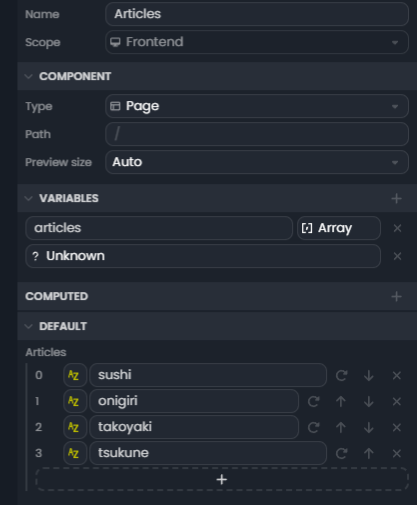

# Logique et contrôle de flux

Le contrôle de flux permet de définir **l’ordre d’exécution** des
nœuds dans votre graphe et de gérer les **conditions** ou **répétitions**
d’actions. Grâce à ces outils, vous pouvez créer des workflows dynamiques
et réactifs, adaptés à différentes situations.

Le contrôle de flux se divise en trois catégories principales :
- **Nœuds conditionnels** : Gèrent les décisions logiques basées sur une condition.
- **Boucles** : Répètent des actions selon un critère donné.
- **Déclencheurs** : Démarrent l'exécution en réponse à un événement (ex. : clic d’un utilisateur).

## Déclencheurs (Triggers)

Les nœuds déclencheurs démarrent l'exécution de la logique lorsqu'un événement spécifique se produit.

Exemple : **Déclencher l’incrémentation d'un score**

1. Ajoutez un nœud **On Click** relié à un bouton de votre interface.
2. Connectez ce nœud à une logique qui modifie la variable <Highlight text="score"/>.

Lorsque l’utilisateur clique sur le bouton, la logique s’exécute et met à jour le score.

## Nœuds conditionnels (If/Else)

Les nœuds conditionnels permettent de tester une condition et d'exécuter différentes actions en fonction du résultat.
Un nœud conditionnel possède :
- Une entrée d'exécution
- Une entrée condition (ex : score > 10)
- Une sortie (Vrai ou Faux)

Exemple : Afficher un message conditionnel avec une variable computed

Dans cet exemple, nous allons afficher un message "You win" lorsque le score dépasse une certaine valeur. Pour cela, nous allons :

1. **Créer une variable computed** pour vérifier si le score est supérieur à <Highlight text="10"/>.
2. **Utiliser cette variable computed** pour afficher ou masquer un message dans l’interface.

### 1. Définir la variable computed

1. Sélectionnez le composant **Layout**.
2. Dans le panneau **Inspector**, ajoutez une variable computed appelée <Highlight text="displayWin"/>.
3. Définissez-la comme un **booléen** (vrai ou faux).

### 2. Utiliser la variable computed dans l’interface

1. Ajoutez un bloc **Template** dans l’interface.
2. À l’intérieur du Template, insérez un composant de texte avec le message "You win".
3. Dans le panneau **Inspector**, associez le composant **Template** à la condition <Highlight text="displayWin"/>.
- Si <Highlight text="displayWin"/> est vrai, le message sera affiché.
- Si <Highlight text="displayWin"/> est faux, le message ne sera pas affiché.

### 3. Définir la logique pour la variable computed

1. Dans le graphe, ajoutez un nœud Get score pour récupérer la valeur actuelle de la variable <Highlight text="score"/>.
2. Utilisez un nœud Condition (<Highlight text="A >= B"/>) pour vérifier si le score est supérieur ou égal à <Highlight text="10"/>.
3. Reliez le résultat de cette condition à la variable **computed displayWin**.

### 4. Tester votre logique

- Modifiez le score en utilisant les boutons dans l’interface.
- Lorsque le score atteint ou dépasse <Highlight text="10"/>, le message "You win" devrait apparaître automatiquement.

## Boucles (For/While)

Les boucles permettent d'exécuter plusieurs fois une logique selon un critère donné :
- **For Each** : Parcourt chaque élément d’un tableau.
- **While** : Répète une logique tant qu'une condition reste vraie.

Exemple : Utilisation d'une boucle **For** pour afficher une liste d’articles

### 1. Création de la page et de la variable articles
1. Créez une nouvelle page nommée **Articles**.
2. Dans le panneau **Inspector**, ajoutez une variable de type **Array** (tableau) appelée <Highlight text="articles"/>.
3. Remplissez cette variable avec des valeurs, par exemple :   <Highlight text='["sushi", "onigiri", "takoyaki", "tsukune"]'/>.

### 2. Mise en place de la logique de boucle
1. Ajoutez un composant **Template** dans l’interface.
2. Configurez le Template avec la logique **For** et associez-le à la variable <Highlight text="articles"/>.
3. La logique For permet de parcourir chaque élément du tableau <Highlight text="articles"/>.
4. Le Template exécutera son contenu une fois pour chaque article.

### 3. Affichage des éléments dans l’interface
1. À l’intérieur du Template, ajoutez un **Bloc**.
2. Insérez un composant **Variable** dans ce bloc.
3. Associez cette variable à <Highlight text="Template[].Value"/>, qui correspond à chaque élément du tableau parcouru.
4. Désormais, lorsque vous visualisez la page **Articles** dans l’interface, vous verrez chaque élément du tableau <Highlight text="articles"/> affiché dans un nouveau bloc.

## Récapitulatif des types de contrôle de flux

| Type | Description | Exemple |
| --- | --- | --- |
| Déclencheur | Exécution déclenchée par un événement | Incrémenter un score lors d’un clic |
| Conditionnel | Test d’une condition logique | Afficher un message si le score dépasse 10 |
| Boucle | Répétition d’une logique sur un ensemble d’éléments | Afficher une liste d’articles |
