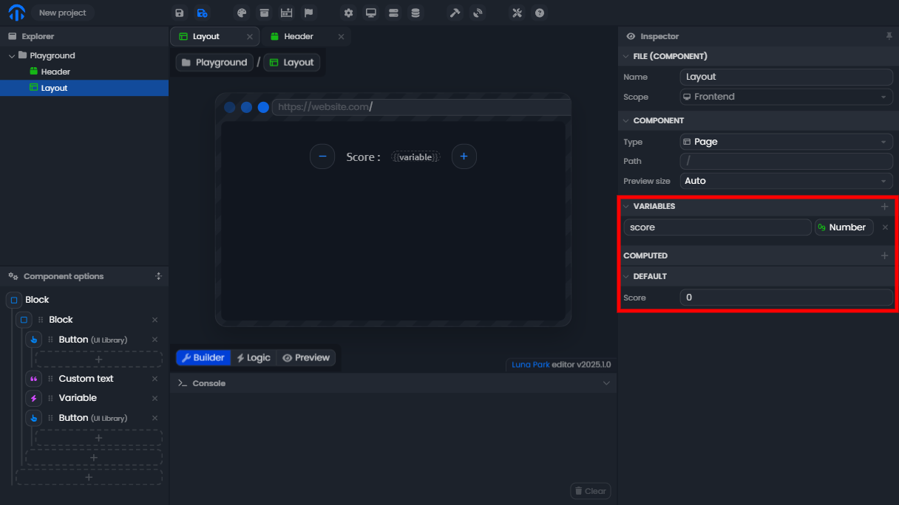
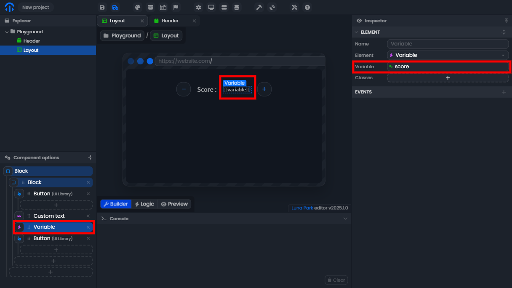
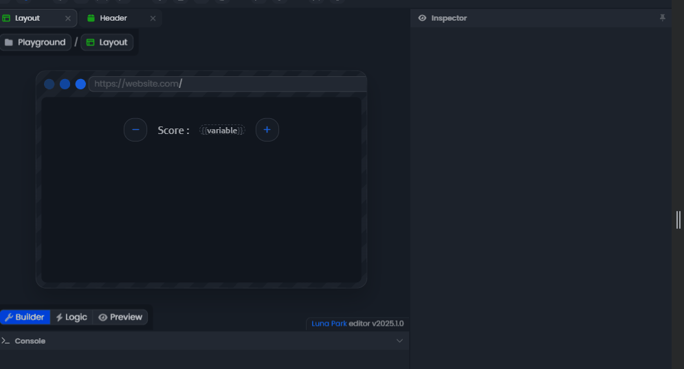
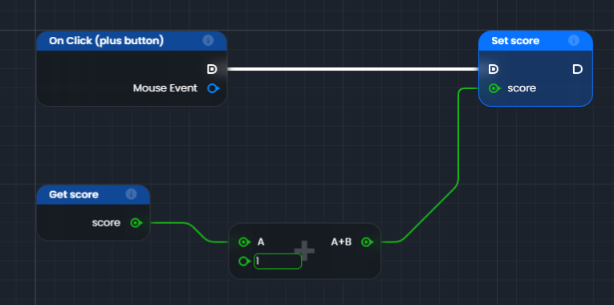
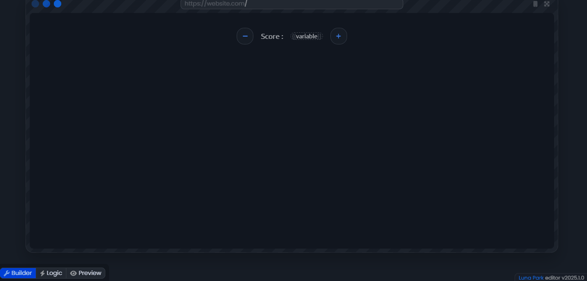

# Les variables

Les variables sont des conteneurs permettant de **stocker** des informations que vous pouvez utiliser et manipuler dans
votre graphe.

Par exemple :

- un score
- un nom d'utilisateur
- une liste d'articles

## Les types de variables

Parmis les types de données que vous pouvez stocker dans des variables, il y a :

- **Chaîne de caractères** : *exemple : `"Hello World"`*
- **Nombre** : *exemple : `42`*
- **Booléen** : *exemple : `true`*
- **Tableau** :  *exemple : `[1, 2, 3]`*
- **Object** : *exemple : `{ name: "John", age: 30 }`*
- **Computed** : Une variable calculée automatiquement en fonction d'autres variables ou données.

_Les variables **computed** sont idéales pour les calculs dépendants de variables existantes. Elles sont automatiquement mises à jour lorsque les variables auxquelles elles sont liées changent._

## Définir, afficher et mettre à jour une variable dans l'interface.

### 1. Définir une variable

1. Sélectionnez le composant **Layout** dans l’éditeur (comme indiqué dans l’image ci-dessous).
2. Dans le panneau Inspector, ajoutez une variable en cliquant sur le bouton <Highlight text="+"/>  dans la section **Variables**.
3. Donnez-lui le nom **score** et définissez sa valeur par défaut à <Highlight text="0"/> .

### 2. Ajouter un affichage de variable dans l'interface

1. Insérez un composant **Variable** dans l’interface.
2. Sélectionnez ce composant et associez-le à la variable score créée précédemment en choisissant cette variable dans le panneau **Inspector**.

### 3. Ajouter des boutons pour modifier la variable

1. Ajoutez deux boutons dans l’interface, un pour **ajouter** et un pour **soustraire** un point au score.
2. Configurez les boutons pour qu’ils déclenchent un événement **On Click**.

### 4. Créer la logique de mise à jour de la variable

1. Utilisez le nœud On Click connecté au bouton <Highlight text="+"/>.
2. Ajoutez les nœuds suivants :
   - Get score pour récupérer la valeur actuelle du score.
   - Addition (+) pour ajouter <Highlight text="1"/> à cette valeur.
   - Set score pour mettre à jour la variable avec le nouveau score.
3. Faites pareil pour le bouton -.

### 5. Tester et vérifier

- Cliquez sur les boutons <Highlight text="+"/> et <Highlight text="-"/> dans l’interface.
- Vous devriez voir la valeur de la variable **score** se mettre à jour en temps réel.

## Réactivité des variables

### 1. Variables dans la logique (non réactives)

- Les variables utilisées dans la logique (graphe) **ne sont pas réactives**.
- Cela signifie que si vous récupérez une variable avec un nœud **Get Variable**, sa valeur est figée à ce moment précis de l'exécution.

Exemple :

1. Un nœud Get score lit la variable <Highlight text="score"/>.
2. Si cette variable est modifiée ailleurs, le nœud **Get score** devra être exécuté de nouveau pour obtenir la valeur mise à jour.

_👉 Utilisez les nœuds de contrôle de flux pour réexécuter les nœuds lorsque nécessaire._

### 2. Variables dans l’interface (réactives)

- Les variables associées aux éléments de l’interface (ex. : texte, champs de formulaire) sont **réactives**.
- Toute modification de leur valeur se répercute immédiatement sur l’élément de l’interface.

Exemple : 

- Si la variable <Highlight text="score"/> est liée à un composant **Variable**, toute mise à jour de <Highlight text="score"/> s’affiche instantanément dans l’interface.

### 3. Variables calculées (Computed)

Les variables **computed** sont des variables dont la valeur est automatiquement recalculée en fonction d’autres variables ou conditions. Elles sont également **réactives**.

Fonctionnement :

- Une variable **computed** dépend d’une ou plusieurs autres variables.
- Lorsque ces variables changent, la valeur de la variable **computed** est mise à jour automatiquement.

Exemple :

1. Une variable <Highlight text="score"/> existe.
2. Vous créez une variable **computed** appelée **scoreX2**, définie comme <Highlight text="score * 2"/>
3. Si <Highlight text="score"/> est modifié, **scoreX2** est automatiquement recalculé.

_👉 Les variables **computed** sont très utiles pour éviter de devoir manuellement recalculer des valeurs._

### 4. Comparaison entre les types de variables

| Type de variable | Réactivité | Utilisation principale |
| --- | --- | --- |
| Logique | Non | Contrôle de flux et logique interne |
| Interface | Oui | Affichage et interaction avec l'utilisateur |
| Computed | Oui | Calculs automatiques basés sur d'autres variables |
