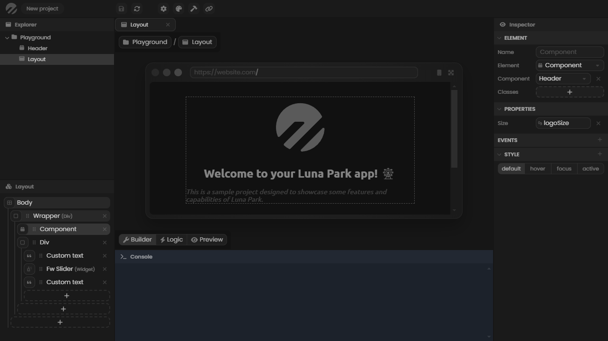
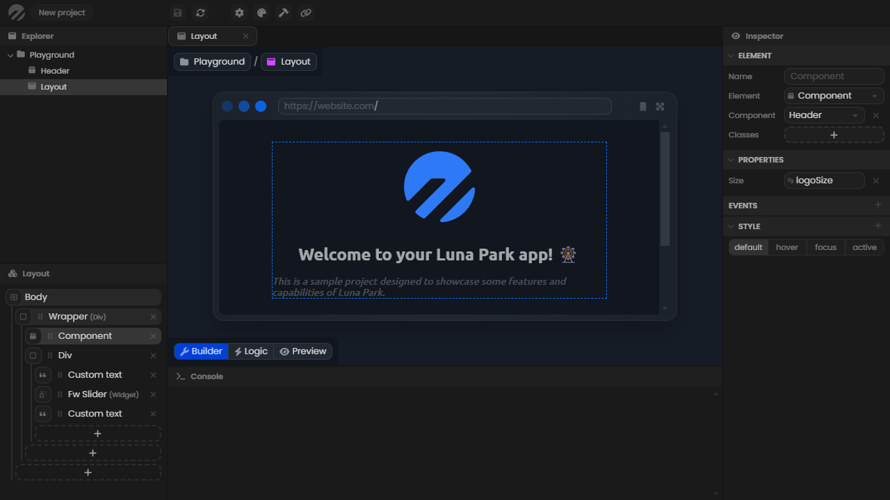

# Luna Park editor

The Luna Park editor allows you to build your app using layout and visual logic. It is composed of several panels that serve a different purpose.

## Explorer panel

The explorer panel is located on the top left corner of the editor. It allows you to create new file with <Highlight text="right click"/>, select it with <Highlight text="double click"/>, and delete it with <Highlight text="del"/>. You can create folders to better organise your project, but the structure doesn't change your app logic.

## Options panel

The options panel is located on the bottom left corner of the editor. It displays various pieces of information relative to the working file. In this case, a layout component is the working file and the options panel displays its layout tree. To set a file as the working file, you need to <Highlight text="double click"/> it in the explorer panel.

## Inspector panel

The inspector panel is located on the right side of the editor. It displays various pieces of information relative to the selected element (a file, a layout element, a logic node...). In this case, a layout element is selected, and the inspector displays everything that define it.

## Console panel

The console panel is located on the bottom side of the editor. It allows you to log values to debug your app. To display a value in it, you need to use the <Highlight text="Log"/> node in the logic editor. Keep in mind that the value will also be logged your actual browser console.

## Viewport

Last but not least, the viewport is the main part of the editor. It displays a visualization of the working file. In this case, the builder mode of a layout component is selected, so it displays the visual layout builder.

 

# Page Layouts

Page layouts are just a special kind of components. They are used to define the structure of a page and will be accessible from your app.

## Component configuration

To set a component as a layout component, simply set the **type** to **page** in the inspector panel. You'll then be able to set a **path** to access the page. The main page of your app should be set to **/**.

## Viewport

The viewport of a page layout is in the form of a virtual browser. You can toggle the mobile view, or display your app in full screen using the top right buttons of the browser. 

 

# Styling

Luna Park allows you to style your app however you like. You can use the inspector panel to style any element. You can also use the palette to customize the global colors.

## Global styling

The global styling of your app is accessible from the **palette** button on the top bar of the editor. The **chroma** values can be interpreted as the saturation fo the color and comes with **hue** values.

Note that you can **match the editor** colors with your app colors by using the match editor option. This can make the building easier for your eyes.

## Element styling

Each element can be styled individually using the inspector panel, under the **style** tab. To add a style category, simply click on the **+** button on the tab. You can then toggle properties by clicking on their name.

Note that some values can use global design tokens. To access them, hover a value, then hover the blue circle that should appear at the top right corner of the value, and select the **place icon** icon.

 

# Dynamic variables

All variables are dynamic. This means that if the value of a variable is changed at any time, it will update everything that depends on it in your app.

To use variables, hover a value, then hover the blue circle that should appear at the top right corner of the value, and select the **place icon** icon. You can then select the variable you want to use. Keep in mind that only variables of the expected type will be available. 