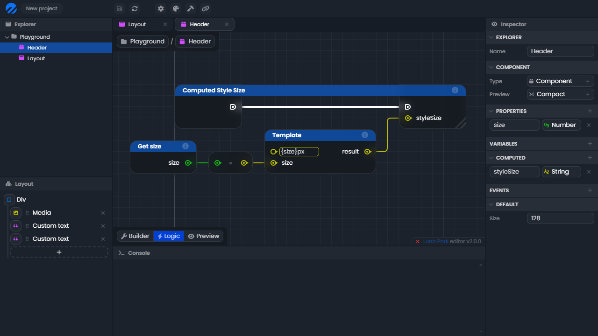

# The visual scripting editor

The visual scripting editor is the tool that allows you to create logic and control flow for your projects. Instead of writing code, you can create scripts by connecting various nodes together in a graph-like structure. These nodes can represent a wide variety of actions, such as comparing values, fetching an API, or sorting an array.

## The graph

The graph is the grid where you can place nodes. The grid is infinite in both direction, but you should keep your logic graph small enough. If your graph become too complex, it may be a good idea to factorize some logic by creating new functions, which can then be used as node. You can move the grid and zoom in and out to get a better picture on what you're working on.

** place grid **
** place instructions **

## Nodes

Nodes are basic logic bricks that be placed onto the grid. There are two main types of node:

- **Function nodes**: Those nodes have a blue background. They have input and/or output execution anchors. They are meant to be executed by the execution thread.
- **Operation nodes**: Those nodes have a dark grey background. They don't have input and/or output execution anchors. They are meant to be evaluated when needed by executed function nodes.

** place nodes **
** place instructions **

## Anchors

Anchors are the interface of the node. Input anchors are display on the left of node, output anchors on the right. There are two types of anchors:

- **Execution anchors** (**place icon**)
  Those anchors are displayed with a square left rounded shape. Those anchors are meant to be linked with the execution thread. A function node will be executed when the execution thread leading to its execution anchors is triggered. Then, after its execution, the node will trigger its output execution anchor.

- **Value anchors** (**place icon**/**place icon**)
  Those anchors are displayed with a circle shape when holding a single value, or a square shape when holding a list (called array) of values. When used as input anchors, you can specify some types, like string and number, in the input next to the anchor. The color of the anchor depend on the type of value it's holding.

<TypeTable
:columns="[
{ title: 'Type', key: 'type' },
{ title: 'Example', key: 'example' },
{ title: 'Type', key: 'type2' },
{ title: 'Example', key: 'example2' }
]"
:rows="visualScriptingEditorTableData"
/>

## Wires

Wires are lines to link two anchors between them. They are white and thick when they represent an execution thread. Otherwise, they take the color of the type they're holding.

Wires allow you to connect anchors of compatible types. Generally, you will connect anchors of the same type. But you can connect input anchors to less defined output anchors. For example, you can connect an (output) array of string to an (input) array of unknown type, but not the other way around.

To better manage your wires, you can create re-route anchors. Those standalone anchors are only visual and do not serve any other purpose. Also, when wires are overlapping, they are shifted to better visualize them. 

** place grid **

Note that this is not a well design logic graph, it's only to showcase wires, wire-staking, and re-route anchors. A well designed logic graph should have an execution thread as straight as possible, making it easier to read. 

** place instructions **

## Inspection

You inspect the values and types held by anchors using "type inspection" and "value inspection". When using "value inspection", values are evaluated for operation nodes, and comes from the last execution for function nodes. If some values are undefined, you may want to trigger your logic once to setup all the values. 

** place instructions **

 

# Logic flow

The logic flow is the order in which your nodes are executed. Usually, the flow start on a triggered event (manual play node, on load node, function...). Then, it follows the execution thread represented by a thick white wire.

The editor animation has been activated on this documentation page, so you can better feel how things are executed and in which order. Keep in mind that execution is almost instant in production environment. You can try out the examples using the "Manual play" button. 

** place grid **

## Branch flow

It is possible to branch your flow into two directions thanks to the if flow node. The execution flow will follow one execution output or the other whether the boolean input anchor "condition" is true or false. Try to check or uncheck it to see the difference. 

** place grid **

## Loop flow

When you want to execute a specific flow for a certain amount of time, you can use loop flow nodes, such as "for", "foreach" or "while". The loop execution output anchor will be executed as many time as needed, then the exit output will be executed. 

** place grid **

## Try/catch error flow

Sometime, you're not sure your flow will behave has expected, and you want to do a specific thing if it goes wrong. You can use the "try" node that will try to execute the flow. If an error is raised (by you, using the "throw" node, or by one of the node you're using), you can catch it and do something accordingly. 

** place grid **

 

# Layout integration

The power of Luna Park lies in its real-time logic reactivity. To leverage this, you'll need to use the visual scripting engine alongside the layout editor. 

## Computed properties

Computed properties let you define a value based on other values. To create a computed property, simply click on the + button in the <Highlight text="computed"/> tab of the inspector panel of a component file. You'll then be able to edit the logic of your computed property in the <Highlight text="logic"/> tab at the bottom left of the viewport.

Computed properties are reactive, meaning that if one of the values used in the computation changes, the computed property will be updated. 

## Custom events

Custom events are used to trigger actions from the component. To create a custom event, simply click on the + button in the <Highlight text="events"/> tab of the inspector panel of a component file. You'll then be able to edit the logic of your custom event in the <Highlight text="logic"/> tab at the bottom left of the viewport.

To trigger a custom event, you'll need to use a <Highlight text="trigger"/> node in the logic and send any kind of data. You can then listen to the event in the parent component. 
